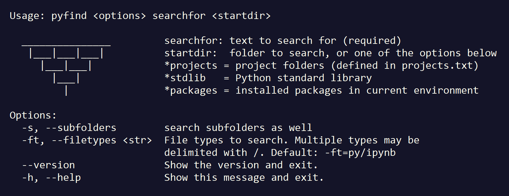

# pyfind
Pyfind is a Click-based command line tool for searching Python source code across multiple projects or packages. I use it when I'm writing code to accomplish some task and want to quickly see examples of how I've accomplished that same task before.

The default behavior is to search all local project folders defined in a ```projects.txt``` file in the pyfind home folder. For example, here's a truncated screenshot of a search for use of the ```json.dumps``` method across my projects, which I might do to remind myself of its syntax:


Each project folder where a hit was found is printed in green, the source files are printed in white, and each hit is printed in cyan with its line number.

Any file type(s) can be searched, and the default is to search ```.py``` source files and ```.ipynb``` notebook files. For notebooks, search hits show the cell number instead of line number:


## Installation

Pyfind requires Python 3.6 or above, and it uses the [Click](http://click.pocoo.org/5/) CLI library. I like to install it as editable, so that I can make changes and have them show up immediately, so I follow these steps to install:

* Clone this repo
* Install prerequisites with ```pip install -r requirements.txt```
* Install pyfind as editable: ```pip install --editable .```

After installation, create a ```projects.txt``` file in the pyfind folder that contains all of the local folders/paths you'd like to include in the default search, one on each line.

After it's installed, you can use ```pyfind``` at a command prompt. For example, use ```pyfind -h``` to display the help screen:



## Usage examples

In addition to the default search scope (all project folders defined in the ```projects.txt``` file), three other usages are supported as covered below.

### explicitly specify a search folder

You can explicitly specify a search folder on the command line, to search files in that folder as well as its subfolders.

The ```-s```/```--subfolders``` command line option controls whether to search subfolders. By default, subfolders are not searched, but you can include this option to search all subfolders.

### searching the Python standard library

The ```*stdlib``` option for the starting folder is a shortcut for searching the Python standard library source code for the currently active Python interpreter. For example, here's a search for ```spam``` in the standard library of Python 3.6.8:


### searching installed packages

The ```*packages``` option for the starting folder is a shortcut for searching across the Python source code for all packages installed in the current environment that pyfind is running in. For example, here's a search across over 2 million lines of code in my current bloated Python environment for use of the ```post``` method in the ```Requests``` package:


### calling search_file from other code
The examples above all use pyfind as a command line tool, however it msy be
useful to call the ```search_file``` function from other code to search a file. Here's
an example:


## Tests
Pytest unit tests are in the ```tests``` folder. Note that tests should be run with the ```pytest``` command from within that folder (and not from the project root folder).

## Contributing
Pyfind is a work in progress &mdash; pull requests, feature requests and issues welcome. I've implemented the functionality I find useful, but I'm interested in knowing what other types of functionality may be useful to others. Please log an [issue](https://github.com/dmahugh/pyfind/issues) if you have a suggestion. Thanks!

## License
Pyfind is licensed under the [MIT License](https://github.com/dmahugh/pyfind/blob/master/LICENSE).

Copyright &copy; 2016 by Doug Mahugh